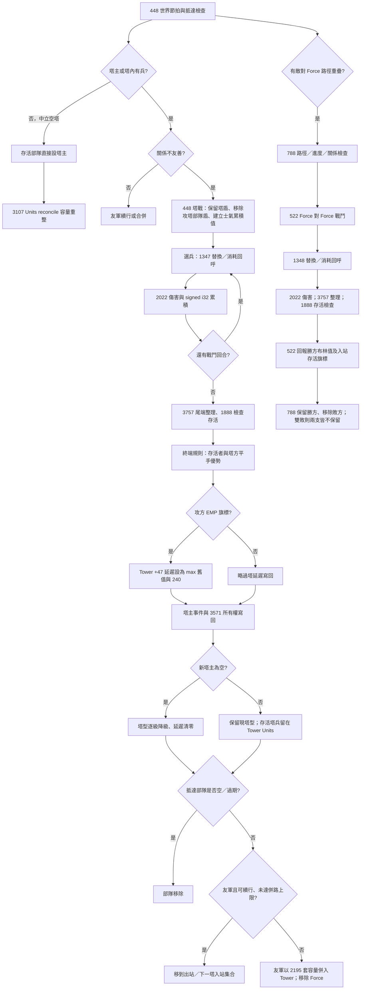

# Battle Tail（戰鬥尾端）流程分析

本圖只涵蓋離線確認的戰鬥生命週期，不呼叫遊戲或 Production WASM（正式版網頁組件）。主路徑對應 `448`、`522`、`1347`、`1348` 與公開來源 `combatants.rs`／`chunk.rs`。

## 核心尾端公式

### `448` 塔戰

- 一般戰鬥回合的單一累積器為 signed i32（有號 32 位元）；`damage > 0` 時下一手由守方選，`damage < 0` 時由攻方選，`damage == 0` 且雙方均有兵時依參考碼順序先讓攻方出手。
- 回合耗盡時，先從兩側各取一個未投入單位。只有其中一側能剩下未投入兵力；尾端最多再處理一次，接著移除仍在 last-unit 欄位上的普通單位。
- `Units::is_alive` 不把 Shield 或已消耗的一次性單位當存活兵。塔方在平手時有守方優勢；攻方要以存活兵勝出。普通支援子集不含特殊單位，因此不依賴特殊事件後處理。
- 攻方勝：`new_owner = attacker_player`；守方勝：`new_owner = old_tower_owner`；無勝者：`new_owner = None`。若原塔有主人且新結果不是守方勝，正式 wrapper 發出失塔事件；只有攻方勝會發出攻方取得塔事件。
- 塔主變空時，塔型逐級降到最低型並把 `Tower+47` 延遲清零。敵方佔領只呼叫 owner setter，不做 Tower Units 容量 reconcile；中立空塔佔領做 reconcile；友軍合併另外套用容量。

### `522` 部隊對撞

- 兩方都使用 Force sentinel 27，沒有 Tower tie-break（塔方平手規則），也不寫 Tower owner、塔型或 EMP 延遲。
- 兩側 Units 原地扣除，`1348` 產生替換／消耗副作用。返回 `true` 代表外層作為 Defender 的出站部隊勝出；同時入站存活旗標只在 Attacker 勝出時保留。若回傳 None／雙敗，`788` 不保留入站敗方，也移除出站敗方。
- 路徑交會、同節拍次序與哪個方向發送事件由 `788`／呼叫者決定；不屬於戰鬥算術函式本身。

## 容量與特效邊界

塔容量在兩個位置起作用：交戰前用於判定塔內溢出的空軍／地面欄位；戰後友軍兵力合併時限制可加入數量。受擊塔的原有存活兵不因敵方佔領自動容量重整。22/22 普通容量列的資料映射已確認；`battle_mirror_partial.py` 目前只在塔戰算術中使用這份容量表，對友軍合併不作預測。

Shell／EMP／Nuke 的傷害、一次性消耗和 EMP 塔延遲已有靜態對應，但鏡像仍安全拒絕它們。EMP 只寫 Tower `+47`；該延遲倒數期間，塔的兵力生產／衰減和中立塔降級分支暫停，不改 Force 移動進度。Ruler（國王）會觸發擊殺者事件，並可能連動玩家淘汰處理，也未納入普通 PvP（玩家對玩家）子集。
